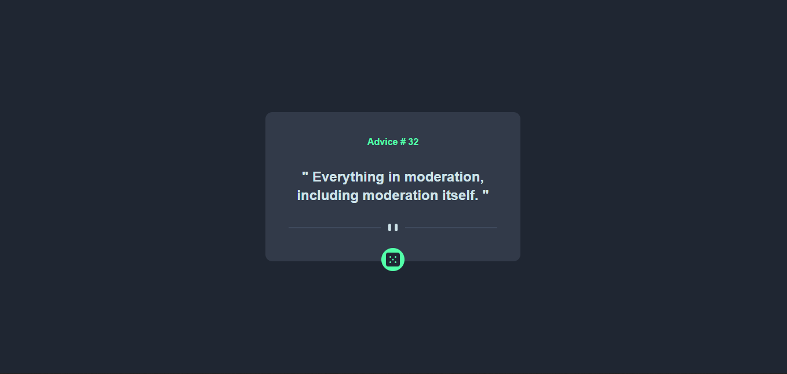
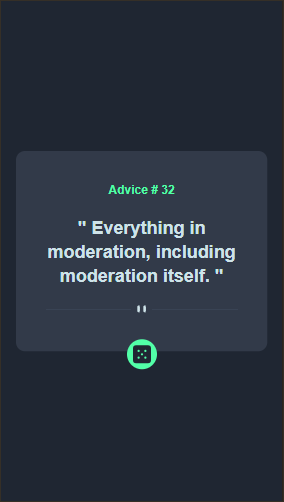

# Frontend Mentor - Advice generator app solution

This is a solution to the [Advice generator app challenge on Frontend Mentor](https://www.frontendmentor.io/challenges/advice-generator-app-QdUG-13db). Frontend Mentor challenges help you improve your coding skills by building realistic projects.

## Table of contents

- [Overview](#overview)
  - [The challenge](#the-challenge)
  - [Screenshot](#screenshot)
  - [Links](#links)
- [My process](#my-process)
  - [Built with](#built-with)
  - [What I learned](#what-i-learned)
  - [Continued development](#continued-development)
- [Author](#author)

## Overview

### The challenge

Users should be able to:

- View the optimal layout for the app depending on their device's screen size
- See hover states for all interactive elements on the page
- Generate a new piece of advice by clicking the dice icon

### Screenshot




### Links

- Solution URL: [solution URL](https://github.com/Ozioma45/Advice_App-React-Tailwind-)
- Live Site URL: [live site URL](https://advice-app-react-tailwind.vercel.app/)

## My process

### Built with

- Semantic HTML5 markup
- CSS custom properties
- Flexbox
- Mobile-first workflow
- [React](https://reactjs.org/) - JS library
- [TailwindCSS](https://tailwindcss.com/) - React framework
- [AdviceSlip](https://api.adviceslip.com/) - Advice api

### What I learned

Most importantly for me, this is a project to test my tailwind skills, surprisingly i must say am beginning to fall for the framework, the flexibility and arrangement is just nice. though am still trying to learn and master it am sure to build a lot more things with this technology.

and customizing the styles is my best part

```js
 theme: {
    colors: {
      "dark-blue": "hsl(218, 23%, 16%)",
      "dark-grayish": "hsl(217, 19%, 24%)",
      "grayish-blue": "hsl(217, 19%, 38%)",
      "neon-green": "hsl(150, 100%, 66%)",
      "light-cyan": "hsl(193, 38%, 86%)",
    },
    boxShadow: {
      "neon-green": "2px 3px 25px hsl(150, 100%, 66%)", // Adjust the shadow as needed
    },
    fontFamily: {
      manrope: ["Manrope", "sans-serif"],
    },}
```

### Continued development

i am now enjoying and getting to know more about reactjs and tailwind. S urely, i would build more with these technology

## Author

- Website - [Ozioma Egole](https://ozioma45.github.io/Myportfolio/)
- Frontend Mentor - [@Ozioma45](https://www.frontendmentor.io/profile/Ozioma45)
- linkedin - [@ozioma-egole](https://www.linkedin.com/in/ozioma-egole/)
- Github - [@Ozioma45](https://github.com/Ozioma45)
